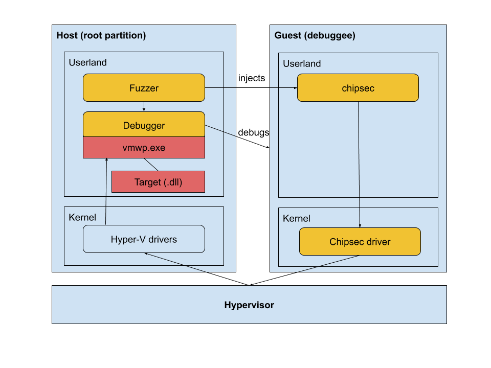

# HYNTROSPECT

```
Copyright 2020 Google LLC

Licensed under the Apache License, Version 2.0 (the "License");
you may not use this file except in compliance with the License.
You may obtain a copy of the License at

    https://www.apache.org/licenses/LICENSE-2.0

Unless required by applicable law or agreed to in writing, software
distributed under the License is distributed on an "AS IS" BASIS,
WITHOUT WARRANTIES OR CONDITIONS OF ANY KIND, either express or implied.
See the License for the specific language governing permissions and
limitations under the License.
```
## WHAT IS HYNTROSPECT?

This tool is a coverage-guided fuzzer targeting Hyper-V emulated devices, in the userland of Hyper-V root partition. Vulnerabilities in that layer coud lead to a guest to root partition escape.

### How does it work?

This fuzzer aims at running the binaries in a real execution context, as close as possible to a regular use, which guided the design towards debugging instead of emulating. It runs at the same level as the target binaries. 

It instruments a debuggee VM by injecting commands (port IOs IN/OUT) into it, having them execute, and then checks the impact on the target binary and its coverage to refine the fuzzing strategy. Windows debugging capabilities are leveraged through [DbgShell](https://github.com/microsoft/DbgShell) to monitor the target binary. The state of the debuggee VM is reset for each input file using Hyper-V checkpoint (~snapshot) capability.

This version supports attaching legitimate and mutated virtual disks to the VM which enables bi-dimensional fuzzing: IOs and file systems.

### Overview of the architecture



Nested virtualization is supported: the hypervisor, root partition and debuggee can run inside a Hyper-V VM. 

The debuggee VM is reset to a clean checkpoint state after the consumption of each input file.

### The targets

The target should by design be in the userland of the root partition, deal with VM IOs, and be loaded by the worker process (vmwp.exe).

Examples: vmemulateddevices.dll, VmEmulatedStorage.dll.

### Supported platforms

This fuzzer runs in the target root partition, hence on Windows. As nested virtualization is supported, the host OS could be any OS supporting Windows / Hyper-V and nested virtualization.

## USAGE

### Prerequisites

Minimal set of requirements: Windows running Hyper-V, IDA if relying on it for the breakpoints computation. 

Instructions:
- Prepare your Hyper-V environment: either Windows as your host OS with [Hyper-V enabled](https://docs.microsoft.com/en-us/virtualization/hyper-v-on-windows/quick-start/enable-hyper-v) or a dedicated VM on the hypervisor of your choice. Nested virtualization is encouraged: this fuzzer would better be run in a VM which itself runs Hyper-V and the debuggee VM, to ease further debugging and resets. In the following instructions, this will be refered to as "host".
- On your host, now that Hyper-V has been enabled, prepare your victim VM:
    - VM with Windows 10
    - Chipsec installed and able to run (VM with driver signature not enforced)
    - Ability to open an [elevated session through WinRM](https://support.microsoft.com/en-us/help/951016/description-of-user-account-control-and-remote-restrictions-in-windows).
    - Checkpoint taken with all of the above (with the VM up).
- Download [DbgShell binaries](https://github.com/microsoft/DbgShell), add them to the core folder (.\core\DbgShell\x64\DbgShell.exe needs to exist).
- Prepare the config file (cf Config file syntax), place it as the same level as Main.ps1.
- [Optional, encouraged] Enable page heap on the targetted binary (this can be done using [gflags](https://docs.microsoft.com/en-us/windows-hardware/drivers/debugger/gflags-and-pageheap)).
- [Optional, encouraged] Prepare seeds for the fuzzer (cf Preparing the seeds). 
- [Optional, encouraged] Prepare a list of the offsets of the blocks that need to be monitored in a file entitled breakpoints-$binary-$MD5hash.txt, put it in the output directory. 
- Open an elevated powershell console. Run "Set-ExecutionPolicy Bypass -Scope Process -Force". The shell is now ready to run the fuzzer. Do not run the script from an ISE console (even elevated). For some reason that I have not tried to understand, DbgShell will not start. Always run Main.ps1 from an elevated shell.

### Config file syntax

A config.json is expected in the same folder as Main.ps1.
Here is a template: 

```json
{
	"Target": "C:\\Windows\\System32\\vmemulateddevices.dll",
	"IOPortRead": [96, 97, 98, 100],
	"IOPortWrite": [96, 97, 100],  
	"VMName": "Debuggee", 
	"VMUsername": "John",
	"VMPassword":  "VMPassword",
	"VMCheckpointName": "Mock",
	"VMChipsecFilepath": "C:\\Users\\John\\Desktop\\chipsec\\chipsec_util.py",
	"HostOutputDir": "C:\\Users\\John\\Desktop\\Hyntrospect-out",
	"MaxInputSize": 4096,
	"MinInputSize": 100,
	"MaxMutationRate": 0.5,
	"HostIdaPath": "C:\\Program Files\\IDA Pro 7.5\\ida64.exe",
	"VirtualDiskType": "vfd"
}
```

The `Target` is the full path to the dll loaded by vmwp.exe implementing the emulated device controller that is targeted. It needs to be reversed beforehand to know the read / write IO ports values that enable communicating with the device (`IOPortRead` and `IOPortWrite`). Those IO ports are written as decimal numbers.

Some information needs to be filled regarding the instrumented (debuggee) VM: its name `VMName`, its username `VMUsername`, its password `VMPassword`, and the name of the snapshot of that VM `VMCheckpointName` that was taken after it has been configured. `VMChipsecFilepath` is the path to chipsec_util.py on the debuggee VM.

`HostOutputDir` is the output directory on the local instance running the fuzzer. 

All arguments are mandatory except the last 5 arguments:
- `HostIdaPath` is used to precompute the blocks' addresses on the target binary when no breakpoint list is found. It is though strongly advised to use the utilities to precompute the blocks beforehand and filter out unneeded blocks to keep the list minimal.
- The default max mutation rate for input files is 0.3. 
- `MinInputSize` and `MaxInputSize` set limits for the corpus files. Default values: 100 and 4096.
- `VirtualDiskType` should be set if the fuzzer needs to run on mutated file systems (bi-dimensional fuzzing mode). The type should then be given as an argument: "vfd", "vhd", "iso", or a combination of those values in a list. If iso is selected, a "template.iso" should be added to data.

### Running the fuzzer

The user will interact with 2 files to run the fuzzer: `Main.ps1` and `config.json`.

**Main file**: `Main.ps1`. It has 2 modes: fuzzing and crash reproduction. 

**Fuzzer mode**: It either runs without argument and consumes the configuration file (config.json) which should be next to Main.ps1, or alternatively takes the path to that file as an argument. 

**Crash reproduction**: It takes one mandatory argument: the path of the crash folder that will be replayed (which should contain at least config.json and the IO input file that caused the crash).

**Configuration file**: `config.json`.

Examples: 
- `PS C:\Users\John\Desktop\Hyntrospect> Main.ps1`: this starts the fuzzer using config.json in the Hyntrospect folder.
- `PS C:\Users\John\Desktop\Hyntrospect> Main.ps1 -configFile ..\MySetup\config.json`: this starts the fuzzer using config.json in the "MySetup" folder
- `PS C:\Users\John\Desktop\Hyntrospect> Main.ps1 -reproFolder ..\Hyntrospect-out\Crash_20-12-04_12-08`: this replays the crash which artefacts were saved in "Crash_20-12-04_12-08". 

Be patient with the first runs: setting the environment takes time and the first runs are tedious (removing lots of breakpoints). The fuzzer will go increasingly faster.

... You probably have a good excuse now to take a coffee and go for a little walk :)

### [Optional, encouraged] Preparing the seeds

A seed made of legitimate traffic guides the fuzzer towards more interesting input and fastens the convergence. It is advised to create that seed. Another benefit of generating the seed is checking all ports were correctly listed.

This can be done `using utils\Create-CorpusSeed.ps1`.

Prior to running it, the config file that will also be used for fuzzing needs to be created along with the target VM. 

Requirement: The symbols will be pulled from either c:\symbols or http://msdl.microsoft.com/download/symbols. Set your environment accordingly.
If the symbols cannot be loaded, the script will fail (DbgShell will write an error message stating that the bp addresses could not be found). 
The load of symbols counts towards the timeout: you may want to re-run it once the symbols are loaded or have a larger timeout.

You will probably need to open the target binary in IDA to check the exact device name. This can easily be done if you look for "NotifyIoPortRead" in the function names.

The script needs to be run from 'utils' which should be next to 'core'. It takes 2 mandatory arguments and 2 optional ones:
- Argument 'ConfigFile': path to the configuration file
- Argument 'FuzzedDevice': name of the target device. It should be the name of the device exactly as displayed in the symbols. Example: FloppyControllerDevice, I8042Device.
- [Optional] Argument 'SeedName': Output file name. It will be placed in the corpus repository, in the output folder. Default value: "seed".
- [Optional] Argument 'Timeout': Duration of the recording in minutes. Default value: 2.

The seed filename shoud start with 'seed', it will be written in a folder named 'corpus' in the output directory (read from the config file) - if some traffic could be recorded.

Once the script has started, you can help it by playing with the VM and generate as much traffic related to the device as possible. For example, for the floppy disk: mount a floppy disk in settings, open A:\, add a file, ...

### [Optional, encouraged] Preparing the breakpoints' list

"breakpoints-$binary-$MD5hash.txt" needs to be created and inserted in the output folder. That output folder (which will be given in the config file later and used for fuzzing) needs to be created. 
$binary is the name of the target without extention. $MD5 the MD5 sum of that file.
Example of a valid name for vmemulateddevices.dll: breakpoints-vmemulateddevices-D497739D96D0B6B3C7635D5FA0078903.txt.

The list needs to contain the offsets of the blocks that need to be watched in the target binary, seperated by new lines. Example:
```
0x10
0x1A
0x2B
```

This list can be created by running `utils\findPatchPoints.py` in IDA. The output file is ~\Desktop\patches.txt. 

It can then be renamed with the correct name and moved to the output folder: 
```powershell
$outputdir = "ExistingOutputFolder"
$target = "vmemulateddevices.dll"
$md5 = (Get-FileHash $target -Algorithm MD5).Hash
$bpList = "breakpoints-" + [System.IO.Path]::GetFileNameWithoutExtension($target) + "-$md5.txt"
Move-Item "~\Desktop\patches.txt" (Join-Path $outputdir $bpList)
```

It is highly recommanded to trim that file to the minimum coverage to avoid latency. < 10 Ko is good. > 50Ko compromises smooth runs. 

If this list of offsets is not submitted, it will be computed using IDA. A valid license is required when running the fuzzer in that case and the path to IDA needs to be given in the config file.

## OUTPUT

### Content of the output folder

It will contain:
- the corpus folder, 
- the breakpoint lists: a copy of the initial list and the updated breakpoint list
- a tmp folder containing any artefact in use
- potentially a corpus for the virtual disks (fscorpus)
- potentially the crash folders

The output folder needs to be checked as the fuzzer will keep running for most crashes.

### Visualizing the coverage in IDA

The coverage can be seen in IDA using [LightHouse](https://github.com/gaasedelen/lighthouse).
Start by installing LightHouse.

A log file of the coverage can then be prepared using .\utils\Create-CoverageFile.ps1 that consumes the breakpoint lists in the output folder (the initial copy saved by the fuzzer and the current one).

### In case of a crash

3 cases:
- If an exception is intercepted by the debugger, a crash folder is created containing the input file, execution context, and the host and guest event logs. The debugger then waits for a user input.
- If the VM crashes / resets silently,  a crash folder is also created, no user input is needed.
- If not caught and the fuzzer stops, the file responsible for the crash is in the 'legacy' folder in the corpus. 

Any case can be replayed by simply starting the fuzzer with the argument "-reproFolder" and the path to that crash folder.
If virtual disks fuzzing is enabled, the previously attached disks will be added to the crash folder. That folder can be given when replaying the case.


## INTERNALS

The **other files** are in `core`:
- fuzzer-master.ps1: fuzzer master, called by Main.ps1 after some checks; it orchestrates the fuzzer logic.
- debugger.ps1: script executed within DbgShell that debugs the target process and deals with the breakpoint logic.
- debugger-seed.ps1: script executed within DbgShell that records the legitimate traffic for the target device to create a fuzzer seed.
- debugger-replay.ps1: script executed within DbgShell that debugs the target process in case of files replayed. Lightened version of debugger.ps1.
- input-generator.ps1: it keeps feeding the input directory with mutated or new input.
- fs-generator.ps1: in case file system fuzzing is activated, it keeps feeding the file system directory with new files.
- vm-monitoring.ps1: it checks that the VM is alive and collects traces if the VM stops running 
- findPatchPoints.py: IDA script that outputs a list of the blocks addresses of the binary.
- replay-case.ps1: master when rerunning one existing case.  
- helper.psm1: library containing helper functions.

All these files need to be in the same folder.

A `data` repository contains templates for the virtual disks.

Additional helpers for the user are in `utils`. 

There are **5 helpers**: 
- **Create-CorpusSeed**.ps1: Prepares a seed in the fuzzer compliant format for the targetted emulated device. Requirement: the symbols need to be present in C:\Symbols for the targetted binary or a network connection will be needed. If the symbols are pulled in real time from the internet, a 2 minutes run might be too short to get a good seed (need to re-run it).  
	- Argument 'ConfigFile': path to the configuration file
	- Argument 'FuzzedDevice': name of the target device. It should be the name of the device exactly as displayed in the symbols. Example: FloppyControllerDevice, I8042Device.
	- [Optional] Argument 'SeedName': Output file name. It will be placed in the corpus repository, in the output folder. Default value: "seed".
	- [Optional] Argument 'Timeout': Duration of the recording in minutes. Default value: 2.
- **Create-CoverageFile**.ps1: Prepares a txt file compliant to LightHouse format that can be loaded in IDA to visualize the coverage.
    - Argument 'InitialBpList': path to the latest breakpoint list
	- Argument 'UpdatedBpList': path to the initial breakpoint list
	- Argument 'OutputDir': folder in which the coverage file will be written
	- Argument 'Binary': binary name which is targetted (name with/without extension, or path)
- **Translate-InputBytesToFulltext**.ps1: Translates an input file in the transcript of the corresponding IO operations
    - Argument 'ConfigFile': path to the configuration file
	- Argument 'InputFile': path to the file that needs to be analyzed
- **findPatchPoints**.py: IDA script that outputs a list of the blocks addresses of the binary
    - [Optional] Argument: output filepath, default: ~/Desktop/patches.txt
- **findPatchPointsWithKeyword**.py: Same IDA script as findPatchPoints.py except that it filters the function names on a given keyword (to restrict the basic blocks to a relevant subset). The keyword is currently hardcoded.

## DISCUSSIONS

### Drawbacks of the method

- This technique is slow.
- This fuzzer cannot be ported to any fuzzing operations that would conflict with the use of PowerShell sessions between the guest and the host (WMI, ...).
- Legitimate VM IOs are not filtered out.

### A special note on bi-dimensional fuzzing

In this context, this refers to attaching corrupt virtual disks to the VM while executing IO operations. This can be enabled by setting "VirtualDiskType" in the configuration file.

The mutation logic right now is basic, consisting in flipping bits of template disks. VHD support in being added (as VHDs cannot be hot-swapped, a mock is currently implemented instead).

### Beyond the emulated devices

The logic of the fuzzer could be ported to other use cases in the userland of the root partition. The input logic and commands sent to the VM would need to be modified to fit the new need.

## Disclaimer

This is not an official Google product.